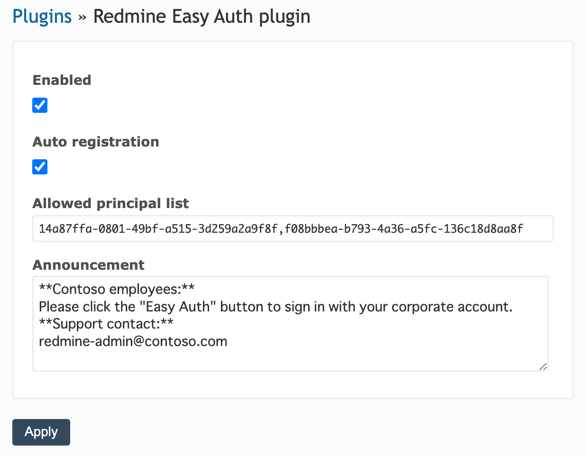
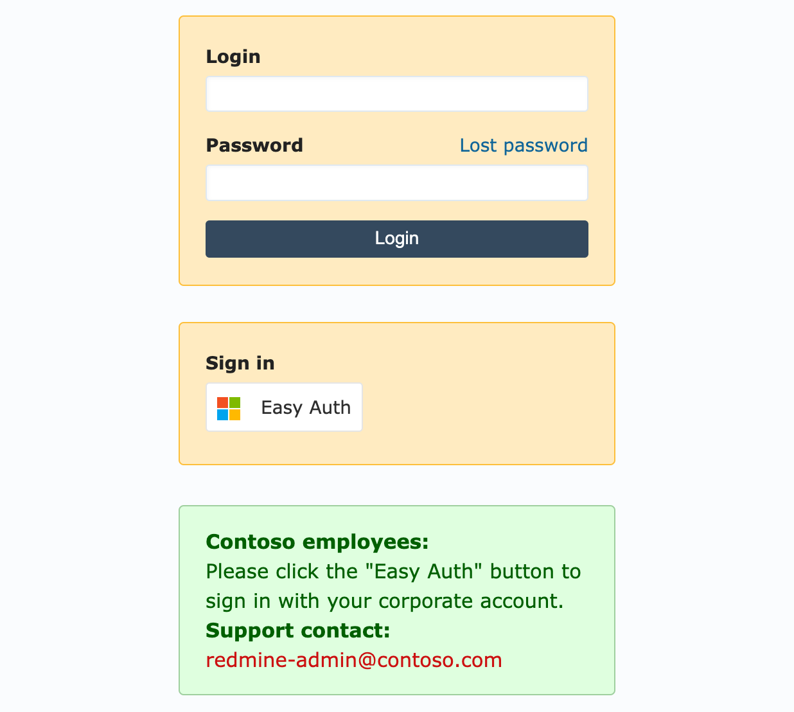

# redmine_easyauth

## Introduction

This plugin simplifies user authentication in Redmine by leveraging [Azure App Service Authentication and Authorization (Easy Auth)](https://learn.microsoft.com/en-us/azure/app-service/overview-authentication-authorization).

You can restrict which users are allowed to log in by using the groups claim. 
Currently, this has only been tested with Microsoft as the Identity Provider (IdP).

## Prerequisites

Redmine must be running on Azure App Service with Easy Auth enabled.

## Configuration

### App Service configuration

Follow the tutorial below to enable the built-in authentication of your App service running the Redmine with this plugin.

- [Tutorial: Add app authentication to your web app running on Azure App Service](https://learn.microsoft.com/en-us/azure/app-service/scenario-secure-app-authentication-app-service)

Select "Microsoft" as the Identity Provider (IdP) to use the authorization features such as the access restrictions by groups.

### Plugin configuration

Navigate to "Administration" → "Plugins" → "Configure" of Redmine Easy Auth plugin to access the configuration page.

- **Enabled:** This option enables the plugin. When enabled, the Easy Auth sign-in button will be displayed on the login page.
- **Auto Registration:** This option allows automatic registration of Redmine users via Easy Auth.
- **Allowed Principal List:** Here, you can specify the object IDs of users or groups that are permitted to authenticate through Easy Auth. You can specify multiple IDs, separated by commas.
- **Announcement:** This field allows you to provide an announcement for users. The announcement will be displayed on the login page and should be formatted using Textile.

> Plugin configuration: 
> 

> Login page with the plugin enabled: 
> 

## Roadmap

### Completed

- User authentication
- Allowed group list

### Upcoming

- User auto registration
- Tests
